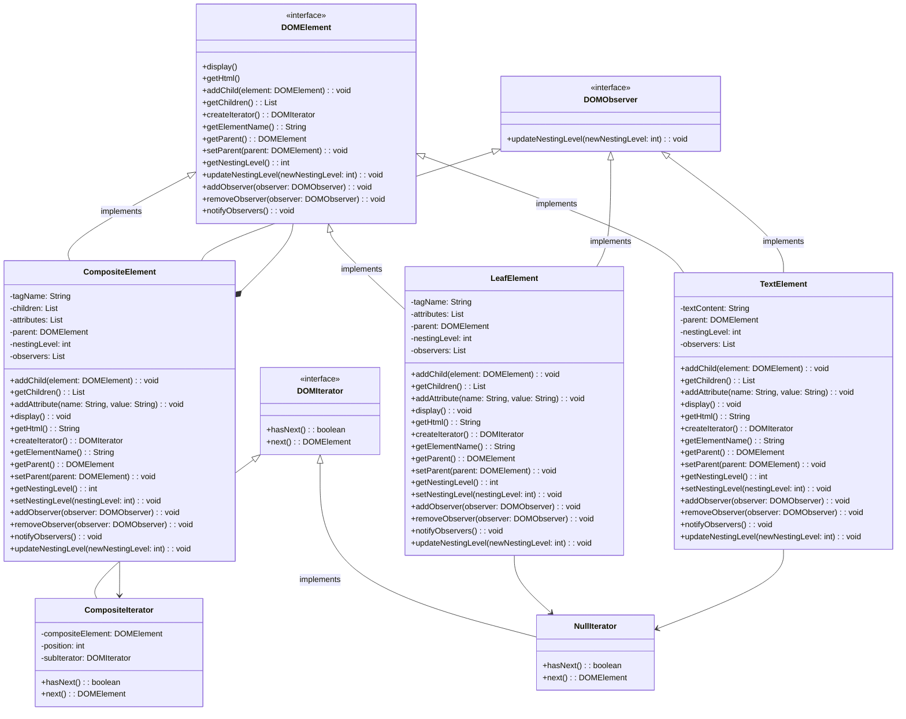

# Composite and Iterator Pattern Demo

## Bonus Builder Design Pattern

* Found in DOM.transform.DOMBuilder
* HTMLParse is just a generic use of org.jsoup, but we could build our own lexical analyzer and parser with something like org.antlr if we wanted to extend this demonstration.
